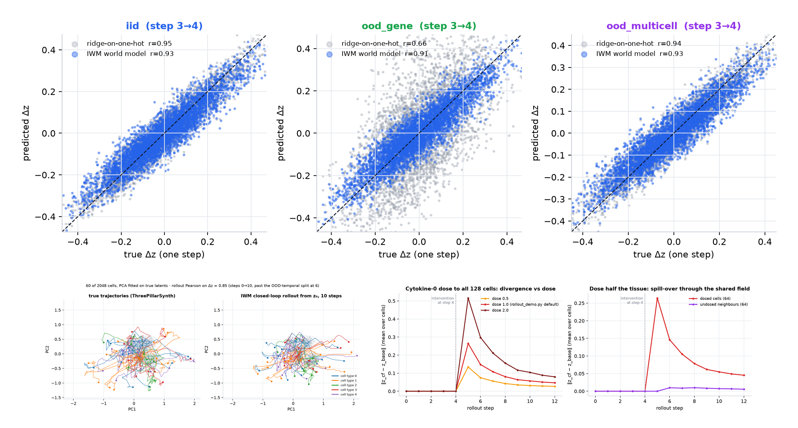
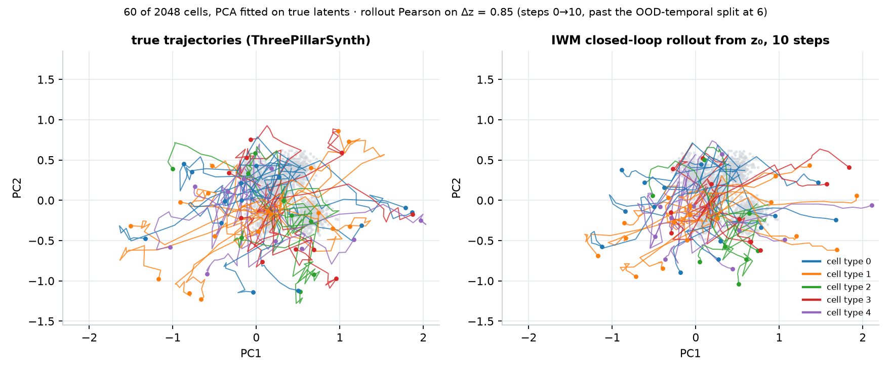
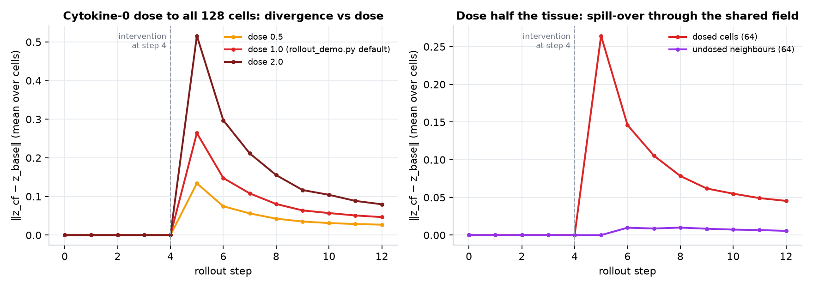
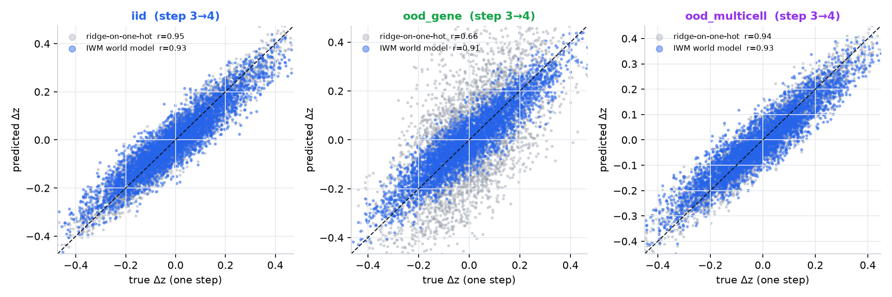
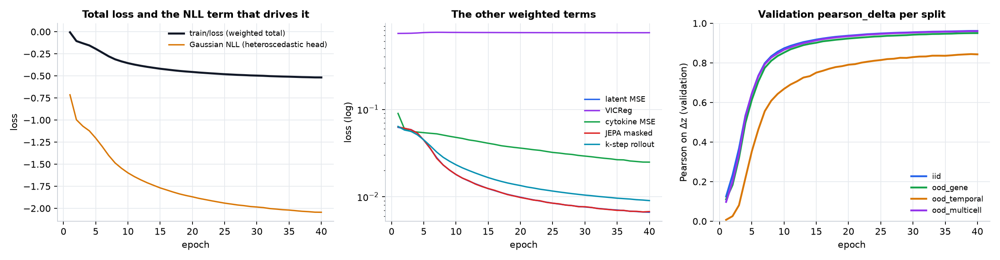
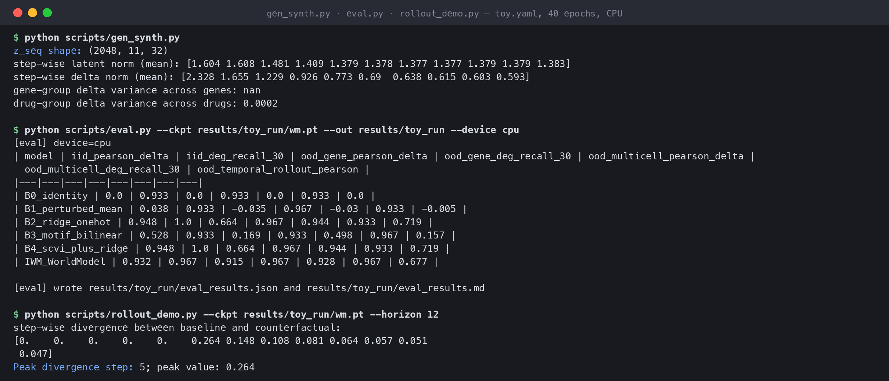

<h1 align="center">Immune World Model</h1>

<p align="center">
  
  
  
  
  
</p>

<p align="center">
  <strong>A learned simulator for populations of immune cells, not an endpoint predictor.</strong><br/>
  IWM is an action-conditioned, multi-cell latent dynamics model inspired by Genie 3 and V-JEPA 2.<br/>
  It rolls cell states forward in time, couples each cell to its neighbours through a shared cytokine field,<br/>
  and takes a compositional action vector: gene KO, drug, cytokine dose, neighbour summary.
</p>

<h3 align="center"><a href="#getting-started"><ins>Getting started</ins></a> · <a href="#results-on-the-synthetic-toy">Results</a> · <a href="docs/01_differentiation.md">Why it is different</a> · <a href="docs/02_architecture.md">Architecture</a> · <a href="docs/03_eval_protocol.md">Evaluation protocol</a></h3>

<p align="center">
  
</p>
<p align="center"><sub>All figures in this README come from one real run of this repository: <code>scripts/train.py</code>'s toy config (2,048 synthetic cells, 40 epochs, CPU, about 5 minutes), then the repo's own <code>ThreePillarSynth</code>, baselines, <code>eval.py</code> metrics and <code>TissueEnv</code> rollouts, plotted with matplotlib. No checkpoints or results are committed; rerun the commands under <a href="#getting-started">Getting started</a> to reproduce them.</sub></p>

Perturbation models in single-cell biology mostly answer one question: given a perturbation, what does the expression profile look like at the end? IWM asks a different one. Given a population of cells, their neighbours, and a sequence of actions, what happens next, and what would have happened under a different action? It is **not** a single-cell foundation model and not an LLM-over-pathway reasoner. It is a world model in the Genie sense: learned latent dynamics you can run trajectory and counterfactual rollouts on. The synthetic generator, the four out-of-distribution splits, the five baselines and the metric definitions are all part of the repository, so every claim is checkable against ridge regression on the same data.

## Features

### Three pillars no existing model covers together

| | Endpoint DE | Trajectory | Multi-cell | Compositional action |
|---|---|---|---|---|
| VCWorld (arXiv 2512.00306) | ✓ | ✗ | ✗ | ✗ |
| STATE / Stack (Arc) | ✓ | ✗ | ✗ | ✗ |
| scFMs (scGPT, Geneformer, UCE, C2S-Scale) | partial | ✗ | ✗ | ✗ |
| TIGON, CellOT, flow matching | population only | ✓ distribution | ✗ | limited |
| PhysiCell / CompuCell3D | N/A | ✓ | ✓ | hand-coded |
| **IWM (this repo)** | ✓ | ✓ | ✓ | ✓ (vector) |

<table>
<tr>
<td width="50%" valign="middle">

### Temporal: trajectories, not endpoints

The model predicts cell-state *trajectories* over multiple time steps. The training loss includes a k-step rollout term (`rollout_steps: 3` in the toy config), and the OOD-temporal split trains on `t ≤ 6` and evaluates closed-loop rollouts beyond it from `z₀` alone, with the model's own prediction fed back as the next input.

On the toy, a 10-step closed-loop rollout from `z₀` reaches Pearson 0.85 on Δz against the true trajectories, including the four steps past the training window.

</td>
<td width="50%">
  
  <p align="center"><sub>PCA fitted on true latents; 60 of 2,048 IID cells, coloured by cell type; dots mark step 10. Left is <code>ThreePillarSynth</code>, right is the trained model rolled out from step 0 with no teacher forcing.</sub></p>
</td>
</tr>
<tr>
<td width="50%" valign="middle">

### Multi-cell: a shared cytokine field

Each cell's next state depends on a learned pooling of its `k = 8` neighbours' latents and a shared cytokine field that decays and accumulates secretions (mean-field). The OOD-multicell split evaluates on novel neighbourhood compositions.

Dose half of a 128-cell tissue with cytokine 0 at step 4 and the other half moves too, through the field rather than through their own action vector. That spill-over is the mechanism endpoint models have no way to express.

</td>
<td width="50%">
  
  <p align="center"><sub><code>TissueEnv.rollout()</code> against <code>with_intervention(Intervention(step=4, delta_cyto=…)).rollout()</code>, mean ‖Δz‖ over cells. Left: whole tissue, three doses. Right: dose 64 of 128 cells; the purple line is the undosed neighbours.</sub></p>
</td>
</tr>
<tr>
<td width="50%" valign="middle">

### Compositional actions and held-out genes

The action is a continuous vector over `{gene KO, drug, cytokine dose, neighbour summary}`, not a discrete "one of N perturbations" index. Gene KO goes through a shared 8-d gene-feature space, so genes never seen in training are still reachable.

This is where the toy separates the world model from ridge-on-one-hot: on the OOD-gene split (25 % of perturbation genes held out) ridge falls to r = 0.66 while IWM stays at 0.91, because one-hot ridge has no row for a gene it never saw.

</td>
<td width="50%">
  
  <p align="center"><sub>One-step Δz at step 3→4, 4,000 sampled (cell, dimension) pairs per split. Grey: ridge-on-one-hot (B2). Blue: IWM. Dashed: identity.</sub></p>
</td>
</tr>
<tr>
<td width="50%" valign="middle">

### Training that converges on CPU in minutes

`iwm/training/losses.py` combines latent MSE, a heteroscedastic Gaussian NLL, VICReg, a JEPA-style masked prediction term, cytokine MSE, optional fate cross-entropy and the k-step rollout loss; weights live in the YAML config. The NLL term dominates the total and keeps falling as the predicted σ tightens, while the MSE-type terms flatten after about ten epochs.

Validation Pearson on Δz is logged per split every epoch by the Lightning module, so you can see the OOD-temporal split lag behind the others from the first epoch.

</td>
<td width="50%">
  
  <p align="center"><sub>Per-epoch <code>trainer.callback_metrics</code> from the 40-epoch toy run. The loss is negative because the NLL term is.</sub></p>
</td>
</tr>
</table>

**Also included**

- **Counterfactual rollouts as the primitive.** `TissueEnv.rollout()` and `TissueEnv.with_intervention(...).rollout()` are the user-facing capability endpoint-only models cannot provide.
- **Baselines built in.** Identity, perturbed-mean, ridge-on-one-hot, motif-bilinear and scVI + ridge are evaluated alongside the world model on every run. Ridge is the opponent to beat (Wenkel, Nat Methods 2025).
- **`ThreePillarSynth`**: a synthetic generator that plants all three pillars (non-linear temporal evolution, neighbour coupling, compositional action decomposition) so the pipeline can be sanity-checked without data.
- **Four pre-registered splits and four metrics**: IID, OOD-gene, OOD-temporal, OOD-multicell × pearson_delta, centroid accuracy, DEG recall@30, rollout Pearson, following Systema (Nat Biotech 2025).
- **Real-data loaders** for CellxGene Census (streams live), Schmidt 2022 (GSE190604), Immune Dictionary (SCP2554), CD4+ Perturb-seq (Dec 2025), Norman 2019 and Adamson 2016, plus a Virtual Cell Challenge metric harness.
- **A commercial-clean default stack.** scVI (BSD-3) for cell embeddings, MolFormer (MIT) for drugs, UCE (MIT) zero-shot; the code itself is MIT. Non-commercial assets (STATE weights, Geneformer, Tahoe-100M) are kept to an explicit research track.
- **Ablation configs** for no-gene-encoder, no-multicell and no-rollout-loss, and a `large` config (8k cells, 50 genes, 64-d latent, 6-layer WM).

---

## Results on the synthetic toy

<p align="center">
  
</p>
<p align="center"><sub><code>scripts/gen_synth.py</code>, <code>scripts/eval.py</code> and <code>scripts/rollout_demo.py</code> run against the 40-epoch toy checkpoint, rendered from the captured text.</sub></p>

The table `eval.py` prints for that checkpoint (Pearson on Δz; higher is better):

| model | iid | ood_gene | ood_multicell | ood_temporal (rollout, steps 6→9) |
| --- | --- | --- | --- | --- |
| B0 identity | 0.000 | 0.000 | 0.000 | 0.000 |
| B1 perturbed mean | 0.038 | −0.035 | −0.030 | −0.005 |
| B2 ridge on one-hot | **0.948** | 0.664 | **0.944** | **0.719** |
| B3 motif bilinear | 0.528 | 0.169 | 0.498 | 0.157 |
| B4 scVI + ridge | **0.948** | 0.664 | **0.944** | **0.719** |
| **IWM world model** | 0.932 | **0.915** | 0.928 | 0.677 |

Read against the pre-registered win conditions in [`docs/03_eval_protocol.md`](docs/03_eval_protocol.md):

- **OOD-gene: met.** IWM ≥ B3 within 0.02 was the bar; IWM beats every baseline by a wide margin (0.915 vs 0.664 for ridge), which is the compositional-action pillar doing its job on held-out genes.
- **OOD-temporal and OOD-multicell: not met on this toy.** The bar was best baseline + 0.05; IWM trails ridge by 0.04 and 0.02 respectively. The synthetic dynamics are close enough to linear that ridge on the previous latent is hard to beat, which is exactly why `docs/03_eval_protocol.md` says a single-split win is not a claim. (B4 equals B2 because the toy has no scVI stage; both fit the same ridge.)

So the honest summary is: the pipeline works end to end, the gene-feature encoder generalises to unseen genes, and the temporal and multi-cell advantages still have to be shown on a harder synthetic (`toy_hard.yaml`, `large.yaml`) or on real time-course data.

<details>
<summary><strong>Evaluation rules (do not violate)</strong></summary>

1. **Always report all four splits.** IID + OOD-gene + OOD-temporal + OOD-multicell. A single-split win is not a claim.
2. **Pearson on delta, not raw.** Systema (Nat Biotech 2025) showed raw Pearson is leaky. `iwm/evaluation/metrics.py` enforces delta.
3. **Motif-ridge is the opponent.** Ridge is the minimum viable baseline and typically beats scFMs on perturbation (Wenkel, Nat Methods 2025).
4. **Rollout ≥ 5 steps** for the OOD-temporal verdict.

Pre-registered win conditions: IWM ≥ B3 on OOD-gene (within 0.02 Pearson); IWM ≥ best baseline + 0.05 on OOD-temporal and on OOD-multicell. If any "must" fails, do not claim the architecture works.

</details>

---

## How it works

```text
┌─ L3: TissueEnv (agent simulator) ──────────────────────────────────────────┐
│  N cells, shared cytokine field c(t)                                        │
│  per cell i:  a_env_i = { c(t), neighbor_pool({z_j : j ∈ N(i)}) }           │
│               z_i(t+1), secretion_i = WM(z_i(t), a_gene, a_drug, a_cyto, a_env_i) │
│  c(t+1) = decay · c(t) + Σ_i secretion_i                                    │
└───────────────────────────────────────▲─────────────────────────────────────┘
┌─ L2: WorldModel (transformer, action-conditioned) ──────────────────────────┐
│  tokens = [CLS_z, z_t, a_gene, a_drug, a_cyto, a_env, Δt]                   │
│  n × TransformerBlock with FiLM on Δt                                       │
│  heads: z_mu, z_log_sigma (heteroscedastic) · cytokine secretion · fate     │
└───────────────────────────────────────▲─────────────────────────────────────┘
┌─ L1: cell embedding + action encoders ──────────────────────────────────────┐
│  z: scVI (BSD-3) 64-d · UCE (MIT) zero-shot · STATE-SE (NC, research only)   │
│  gene: learned embedding over gene features · drug: MolFormer / one-hot     │
│  cyto: log-scaled dose projection · env: mean + attention pool over neighbours │
└─────────────────────────────────────────────────────────────────────────────┘
```

1. **Data.** `iwm/data/synthetic.py` generates T-step trajectories for `n_cells` with neighbour coupling and a shared gene-feature matrix; `iwm/data/datamodule.py` wraps them in a Lightning DataModule. `--data real:<iwm_sample.npz>` skips generation and reads scVI latents produced by `scripts/pretrain_scvi.py`.
2. **Splits.** `iwm/evaluation/splits.py` builds IID, OOD-gene (held-out perturbation genes), OOD-temporal (train on t ≤ T_tr, evaluate beyond it from z_0) and OOD-multicell (novel neighbourhood compositions).
3. **Training.** `iwm/training/losses.py` combines latent MSE, Gaussian NLL, VICReg, a JEPA-style masked prediction term, cytokine MSE, optional fate cross-entropy and a k-step rollout loss; weights live in the YAML config. The toy world model has 4 transformer layers, 4 heads, a 64-d token width and a 32-d latent.
4. **Evaluation.** `scripts/eval.py` scores the world model and baselines B0–B4 on all four splits with Systema-style metrics (Pearson on delta, never on raw expression) and writes a markdown table.
5. **Rollout.** `scripts/rollout_demo.py` builds a `TissueEnv` from a checkpoint and compares `rollout()` against `with_intervention(...).rollout()`.

<details>
<summary><strong>Related work (April 2026 snapshot)</strong></summary>

- **Genie 3** (DeepMind, Aug 2025): autoregressive transformer for real-time world generation. IWM borrows the action-conditioning idea.
- **V-JEPA 2 / V-JEPA 2-AC** (Meta, Jun 2025): joint embedding predictive architecture + MPC. IWM's latent-prediction head is JEPA-ish.
- **STATE / Stack** (Arc Institute): SOTA endpoint perturbation models; non-commercial license.
- **VCWorld** (arXiv 2512.00306): LLM + pathway KG for DE prediction. IWM's main structural differentiator is not being that.
- **C2S-Scale** (Google/Yale, Oct 2025): Apache-2.0 cell-sentence LLM, usable as a gene-relation prior.
- **TIGON / CellOT / flow matching**: population-level trajectory models; IWM borrows the training signal.
- **Systema** (Nat Biotech 2025): mandatory reading on baselines.

The full table with URLs is in [`docs/01_differentiation.md`](docs/01_differentiation.md).

</details>

---

## Tech stack

<p>
  <kbd>Python&nbsp;3.10+</kbd> &nbsp; <kbd>PyTorch&nbsp;2.2+</kbd> &nbsp; <kbd>PyTorch&nbsp;Lightning&nbsp;2.2+</kbd> &nbsp; <kbd>NumPy</kbd> &nbsp; <kbd>SciPy</kbd> &nbsp; <kbd>scikit-learn</kbd> &nbsp; <kbd>pandas</kbd> &nbsp; <kbd>pydantic&nbsp;2</kbd> &nbsp; <kbd>PyYAML</kbd> &nbsp; <kbd>matplotlib</kbd> &nbsp;
  <kbd>scanpy&nbsp;/&nbsp;anndata&nbsp;/&nbsp;scvi-tools&nbsp;(extra)</kbd> &nbsp; <kbd>cellxgene-census&nbsp;(extra)</kbd> &nbsp; <kbd>pytest</kbd> &nbsp; <kbd>ruff</kbd>
</p>

---

## Getting started

**Prerequisites**

- Python 3.10+. Apple Silicon (MPS) or an Nvidia GPU (CUDA) is picked automatically by `accelerator: auto`; CPU works with threads raised to the physical-core count.
- For real data: `pip install -e .[real] cellxgene-census`.

```bash
git clone https://github.com/yc9954/immune-world-model.git
cd immune-world-model
python3 -m venv .venv && source .venv/bin/activate
pip install -e .                       # add .[real] cellxgene-census for real-data runs

python scripts/gen_synth.py            # 1. synthetic sanity check: are the three pillars present?
python scripts/train.py --epochs 40    # 2. toy run (2k cells, ~5 min on M-series MPS or a 10-core CPU) → results/toy_run/wm.pt
python scripts/eval.py                 #    four splits × world model + baselines → results/toy_run/eval_results.md
python scripts/rollout_demo.py         # 3. counterfactual rollout: rollout() vs with_intervention().rollout()

# 4. large experiment (8k cells, 50 genes, 64-d latent, 6-layer WM, ~20 min MPS)
python scripts/train.py --config iwm/configs/large.yaml --epochs 30
python scripts/eval.py  --config iwm/configs/large.yaml --ckpt results/large_run/wm.pt --out results/large_run

# 5. real data: stream an immune subset from CellxGene Census (CC-BY), pretrain scVI, train on its latents
python scripts/prepare_real_data.py --n-cells 50000 --tissue blood
python scripts/pretrain_scvi.py --adata data_cache/cx_immune_*.h5ad --out results/scvi_run --latent 64 --epochs 20 --accelerator auto
python scripts/train.py --data real:results/scvi_run/iwm_sample.npz
```

`results/` and `data_cache/` are git-ignored; checkpoints, eval tables and pulled data stay local. Steps 1–3 are exactly what produced the figures above (step 2 was run with `--accelerator cpu`).

**Hardware.** Measured on an Apple M5 (10-core), 5 epochs of the toy: CPU with 10 threads 6.83 it/s (~7.0 s/epoch; torch's default 4 threads was 1.8× slower), MPS 12.04 it/s (~4.0 s/epoch, 1.76× per-step). For runs under ~30 s total the MPS kernel-JIT tax can eat the gain; the gap widens with longer schedules. Tuning knobs in the config: `training.accelerator`, `training.precision` (`32 | bf16-mixed`, bf16 only on M3+), `training.num_workers`, `training.threads`.

| Config | What it is |
| --- | --- |
| `iwm/configs/toy.yaml` | Default: 2,048 cells, 5 cell types, 20 perturbation genes, 32-d latent, 4-layer WM, 40 epochs. |
| `toy_hard.yaml`, `toy_deeper.yaml`, `toy_fixed.yaml` | Harder synthetic / deeper model variants of the toy. |
| `large.yaml` | 8k cells, 50 genes, 64-d latent, 6-layer WM. |
| `ablation_a1_no_gene_enc.yaml`, `a2_no_multicell.yaml`, `a3_no_rollout.yaml` | Drop one pillar at a time; each should cost pearson_delta on its matching split. |
| `commercial.yaml`, `research.yaml` | Same interface, different L1 / action encoders (license-clean vs non-commercial assets). |

---

## Building and testing

```bash
pytest            # 11 unit tests: synthetic generator, world-model shapes, baseline sanity (~30 s on CPU)
ruff check .      # line-length 100
```

---

## Scripts

| Script | What it does |
| --- | --- |
| `scripts/gen_synth.py` | Prints summary statistics of the synthetic generator so you can confirm temporal evolution, neighbour coupling and action decomposition are present. |
| `scripts/train.py` | Trains the world model with Lightning; `--config`, `--epochs`, `--out`, `--data real:<npz>`, `--accelerator`, `--precision`. |
| `scripts/eval.py` | World model + baselines B0–B4 on the four splits; prints and saves a markdown table. |
| `scripts/rollout_demo.py` | Counterfactual rollout on a `TissueEnv` (`--ckpt`, `--horizon`). |
| `scripts/prepare_real_data.py` | Streams an immune subset from CellxGene Census into `data_cache/` (the only source pulled automatically). |
| `scripts/pretrain_scvi.py` | Trains an scVI encoder on an `.h5ad`; writes the model dir, `latent.npy` and an IWM-compatible `iwm_sample.npz`. |
| `scripts/run_perturb_seq_pipeline.py` | One-command Norman 2019 pipeline: download, scVI, IWM, OOD-gene evaluation vs ridge. |
| `scripts/decode_prediction.py` | Decodes IWM latent predictions back to gene space through the scVI decoder and lists top DEGs. |

---

## Repository structure

| Path | What lives there |
| --- | --- |
| `iwm/data/` | `ThreePillarSynth` generator, Lightning DataModule, and `real/` loaders (CellxGene, Schmidt 2022, Immune Dictionary, CD4+ Perturb-seq 2025, Norman 2019, Adamson 2016). |
| `iwm/embeddings/` | Factorised action encoders, multi-cell neighbour pool, optional scVI wrapper. |
| `iwm/models/` | `WorldModel` (L2 transformer), baselines B0–B4, `TissueEnv` + `Intervention` (L3). |
| `iwm/training/` | Losses (MSE, NLL, VICReg, JEPA-masked, cytokine, fate, rollout, flow) and the Lightning module. |
| `iwm/evaluation/` | Systema-style metrics, the four split definitions, Virtual Cell Challenge harness. |
| `iwm/configs/` | toy / large / ablation / commercial / research YAMLs. |
| `scripts/` | The entry points listed above. |
| `tests/` | 11 pytest tests. |
| `docs/` | `01_differentiation`, `02_architecture`, `03_eval_protocol`, `04_real_data`, and the README figures (`overview.png`, `training-curves.png`, `pred-vs-truth.png`, `latent-trajectories.png`, `counterfactual.png`, `term-eval.png`). |
| `pyproject.toml` | Package `iwm` 0.1.0, extras `real` and `dev`. |

---

## Project status

**Engineering complete, scientific validation partial.**

**Working today.** The pipeline runs end-to-end on the synthetic toy: generation, training on MPS / CUDA / CPU, evaluation of the world model and five baselines on four splits, and counterfactual rollouts; the figures above are that run. CellxGene Census streaming and scVI pretraining work; `train.py --data real:` reads the resulting sample. All 11 tests pass.

**Shown on the toy.** The OOD-gene pillar: the gene-feature encoder generalises to held-out perturbation genes where one-hot ridge cannot (0.915 vs 0.664 Pearson on Δz). Counterfactual interventions propagate to undosed neighbours through the cytokine field.

**Not yet shown.** The temporal and multi-cell advantages over ridge. On the default toy, ridge on the previous latent edges out the world model on the IID, OOD-multicell and OOD-temporal rollout numbers, so the pre-registered `+0.05` conditions for those two splits are not met. That needs either a stronger synthetic (shared gene features + more strongly non-linear dynamics; see `toy_hard.yaml`) or real time-course Perturb-seq data. No results are checked in (`results/` is git-ignored).

**Known quirks.** `scripts/gen_synth.py` prints `nan` for the gene-group delta variance because the IID sample only contains the 15 non-held-out genes, so five gene groups are empty; the drug-group number is the informative one. `scripts/eval.py`'s B4 (scVI + ridge) equals B2 on synthetic data because there is no scVI stage to differ on.

**Remaining work.** Trajectory reconstruction from snapshot Perturb-seq (TIGON / flow matching) until true time-course data dominate; swapping the random gene-feature prior for gene2vec / ESM-2; running the three ablations; benchmarking against STATE / Stack on the Virtual Cell Challenge 2026 when the data drop (research track only). Real datasets other than CellxGene need a manual download per their licenses; see [`docs/04_real_data.md`](docs/04_real_data.md).

**Licensing constraints.** Default dependencies (torch BSD-3, Lightning Apache-2, scikit-learn BSD-3, numpy BSD-3, scvi-tools BSD-3) are commercial-clean. Do not check in or train against Tahoe-100M (CC-BY-NC), STATE weights, Geneformer weights or scFoundation weights (all non-commercial) without a license audit; see [`docs/02_architecture.md`](docs/02_architecture.md).

---

## Credits and license

Built by [yc9954](https://github.com/yc9954). The evaluation discipline follows Systema (Nat Biotech 2025) and Wenkel (Nat Methods 2025); the architecture borrows action conditioning from Genie 3 and latent prediction from V-JEPA 2, as laid out in [`docs/01_differentiation.md`](docs/01_differentiation.md).

`pyproject.toml` declares MIT, but no LICENSE file is committed yet, so default copyright applies: all rights reserved.
